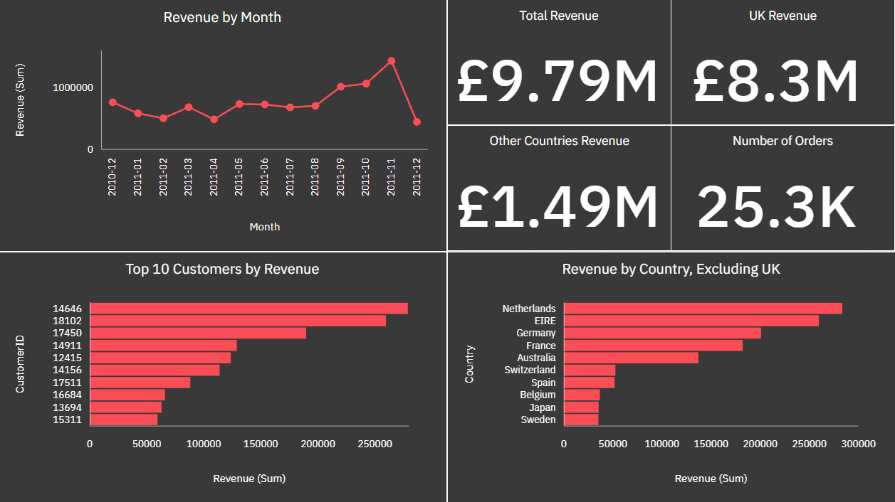
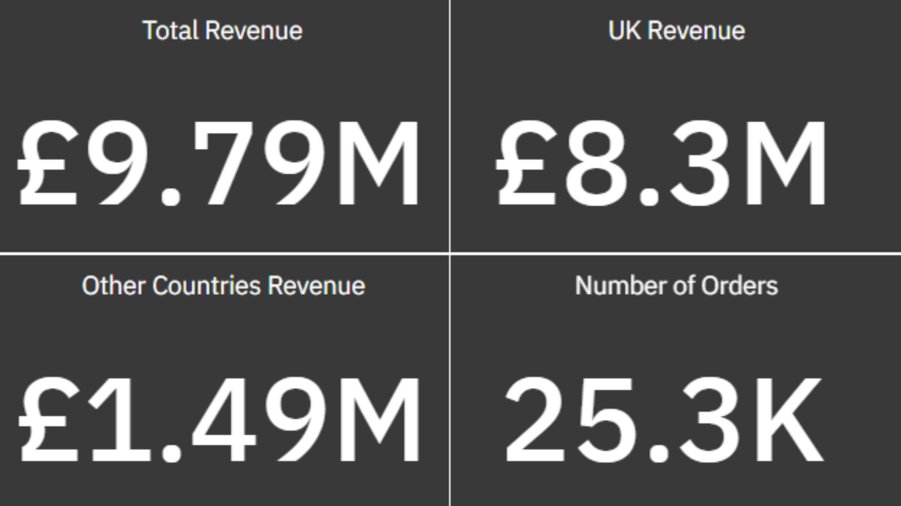
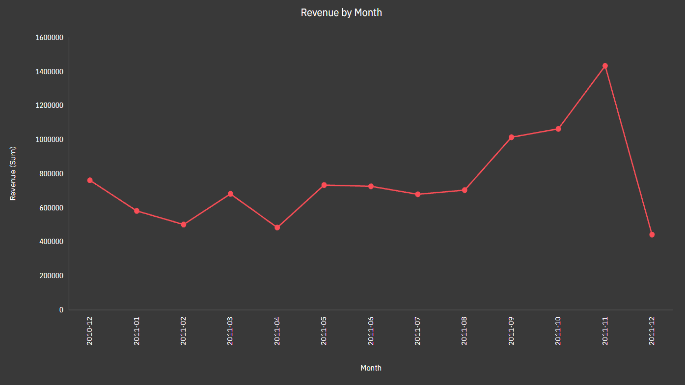
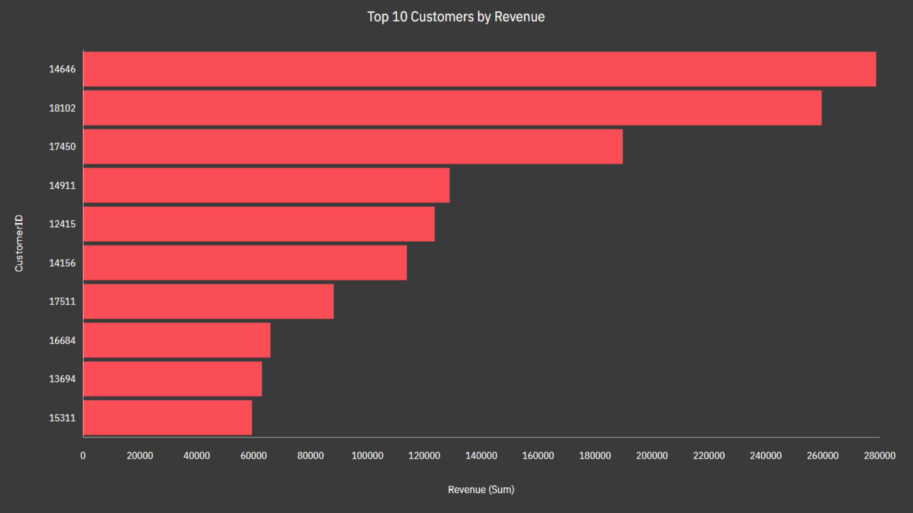
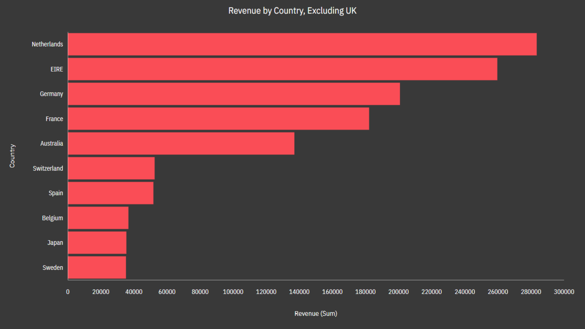
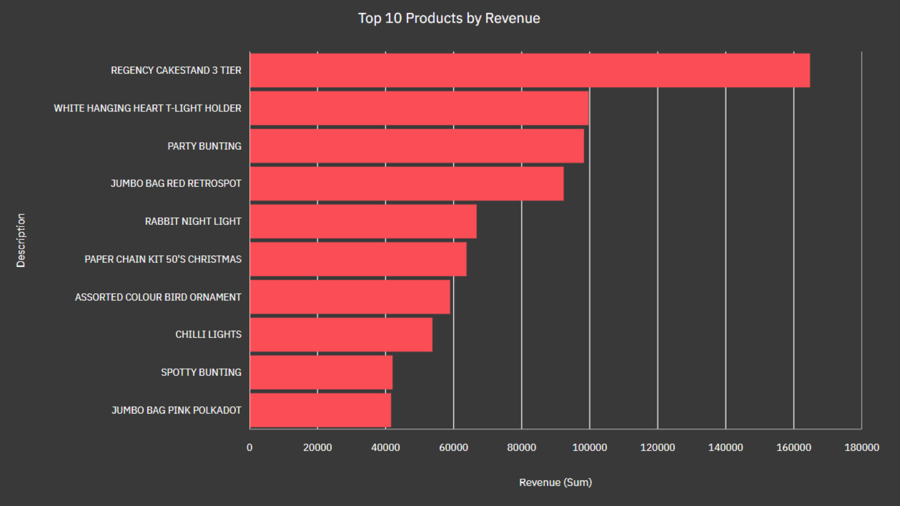

# E-commerce Sales Analysis

## Overview

This project analyzes sales transactions from an online retail business using Microsoft Excel and IBM Cognos Analytics.

The objective is to identify revenue trends, geographic performance, and the most valuable customers and products. The project follows a practical data analyst workflow: data preparation, metric creation, exploratory analysis, dashboard development, and business recommendations.

## Business Questions

* How does revenue change over time?
* How much revenue comes from the UK and other countries?
* Which countries generate the most revenue outside the UK?
* Which customers contribute the most revenue?
* Which products generate the highest revenue?
* What business actions could improve sales performance?

## Dataset

The project uses the **UCI Online Retail dataset**.

* **Records:** 541,909 transactions
* **Period:** December 1, 2010 – December 9, 2011
* **Currency:** GBP
* **Source:** [UCI Online Retail Dataset](https://archive.ics.uci.edu/dataset/352/online+retail)

The dataset contains the following main fields:

`InvoiceNo`, `StockCode`, `Description`, `Quantity`, `InvoiceDate`, `UnitPrice`, `CustomerID`, and `Country`.

## Tools

* Microsoft Excel
* IBM Cognos Analytics
* GitHub

## Data Preparation

The original dataset was preserved in `Raw_Data.xlsx`. A separate `Working_Data.xlsx` file was used for data preparation and analysis.

The following calculated fields were added:

* **Revenue:** `Quantity × UnitPrice`
* **Month:** Month extracted from `InvoiceDate` in `YYYY-MM` format
* **Cancellation:** Identifies invoices beginning with `C`
* **Transaction Type:** Separates product transactions from non-product entries
* **Negative Revenue:** Identifies transactions with revenue below zero

Non-product entries were excluded from the main dashboard analysis.

Cancellation-related and negative-revenue records were retained where appropriate because they may represent returns, refunds, or other revenue adjustments.

## Dashboard

The IBM Cognos dashboard contains two main analytical sections.

### Sales Overview

* Revenue by Month
* Total Revenue
* UK Revenue
* Other Countries Revenue
* Number of Non-Cancelled Orders
* Top 10 Customers by Revenue
* Revenue by Country, Excluding UK

### Product Analysis

* Top 10 Products by Revenue

## Dashboard Preview

### Sales Overview

### Key Performance Indicators

### Revenue by Month

### Top 10 Customers by Revenue

### Revenue by Country, Excluding UK

### Top 10 Products by Revenue

## Key Findings

* The UK is the primary revenue-generating market.
* Other countries represent a smaller but important share of total sales.
* Revenue varies across months, allowing historical trend analysis.
* A relatively small group of customers contributes a significant share of revenue.
* Product revenue is concentrated among the highest-performing products.
* International markets and high-value customers may provide opportunities for further growth.

## Limitations

* The dataset ends on December 9, 2011, so December revenue is incomplete.
* Some transactions do not have a `CustomerID`, limiting customer-level analysis.
* The dataset does not contain cost information, so profit, profit margin, and net profit cannot be calculated.
* The analysis focuses on revenue rather than product quantity because products have significantly different prices.
* The results describe historical transactions and may not represent current business conditions.

## Repository Contents

* `data/Raw_Data.xlsx` — original dataset
* `data/Working_Data.xlsx` — prepared dataset used for analysis
* `data/README.md` — data folder documentation
* `screenshots/` — dashboard screenshots
* `screenshots/README.md` — screenshot documentation

## Conclusion

This project demonstrates the use of Excel for data preparation and IBM Cognos Analytics for dashboard development.

It focuses on revenue performance, customer contribution, product performance, and geographic sales analysis while documenting important data-quality considerations and analytical limitations.
